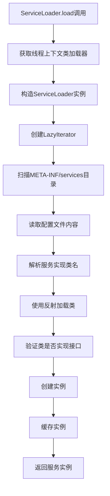

# SPI机制详解

## 1. 什么是SPI机制

### 1.1 SPI定义
SPI（Service Provider Interface）即服务提供者接口，是Java平台提供的一套用于服务发现的机制。SPI的设计理念源于面向对象编程中的依赖倒置原则（Dependency Inversion Principle），它将接口的定义与实现完全分离，使得程序在运行时能够动态地发现并加载具体的服务实现。

### 1.2 SPI的核心思想
- **解耦合**：服务接口的定义与具体实现完全分离，降低了模块间的耦合度
- **可扩展性**：支持在运行时动态发现和加载新的服务实现，无需修改现有代码
- **标准化**：提供了统一的服务发现规范，确保了不同实现之间的一致性
- **插件化**：为应用程序提供了强大的插件机制支持

## 2. SPI机制深层原理

### 2.1 类加载机制详解
  SPI的核心依赖于Java的类加载机制,当服务的提供者提供了一种接口的实现之后，需要在classpath下的`META-INF/services/`目录里创建一个以服务接口命名的文件，这个文件里的内容就是这个接口的具体的实现类。当其他的程序需要这个服务的时候，就可以通过查找这个jar包（一般都是以jar包做依赖）的`META-INF/services/`中的配置文件，配置文件中有接口的具体实现类名，可以根据这个类名进行加载实例化，就可以使用该服务了。


当ServiceLoader.load()被调用时，会触发以下过程：

1. **双亲委派模型**：遵循Java类加载的双亲委派模型
2. **线程上下文类加载器**：使用Thread.currentThread().getContextClassLoader()
3. **资源定位**：在classpath中搜索META-INF/services目录
4. **延迟加载**：实现类在第一次被访问时才真正加载

### 2.2 ServiceLoader源码详解

#### 2.2.1 核心字段和构造过程

```java
public final class ServiceLoader<S> implements Iterable<S> {
    // 服务接口的Class对象
    private final Class<S> service;
    
    // 类加载器
    private final ClassLoader loader;
    
    // 访问控制上下文
    private final AccessControlContext acc;
    
    // 缓存已实例化的服务提供者
    private LinkedHashMap<String,S> providers = new LinkedHashMap<>();
    
    // 懒加载迭代器
    private LazyIterator lookupIterator;
    
    // SPI配置文件路径前缀
    private static final String PREFIX = "META-INF/services/";
}
```

#### 2.2.2 服务加载方法分析

```java
// 主要的load方法，使用线程上下文类加载器
public static <S> ServiceLoader<S> load(Class<S> service) {
    ClassLoader cl = Thread.currentThread().getContextClassLoader();
    return ServiceLoader.load(service, cl);
}

// 重载方法，可以指定类加载器
public static <S> ServiceLoader<S> load(Class<S> service, ClassLoader loader) {
    return new ServiceLoader<>(service, loader);
}

// 私有构造方法
private ServiceLoader(Class<S> svc, ClassLoader cl) {
    service = Objects.requireNonNull(svc, "Service interface cannot be null");
    loader = (cl == null) ? ClassLoader.getSystemClassLoader() : cl;
    acc = (System.getSecurityManager() != null) ? AccessController.getContext() : null;
    reload();
}

// 重新加载服务
public void reload() {
    providers.clear();
    lookupIterator = new LazyIterator(service, loader);
}
```

#### 2.2.3 线程上下文类加载器的作用

**关键理解：** `ClassLoader cl = Thread.currentThread().getContextClassLoader();`

  `cl` 就是**线程上下文类加载器**（Thread Context ClassLoader）。这是每个线程持有的类加载器，线程上下文类加载器默认情况下是应用程序类加载器（Application ClassLoader），它负责加载 classpath 上的类。当核心库需要加载应用程序提供的类时，它可以使用线程上下文类加载器来完成。这样，即使是由引导类加载器加载的核心库代码，也能够加载并使用由应用程序类加载器加载的类。

这行代码解决了Java双亲委派模型在SPI场景下的局限性：
- **双亲委派模型**：子类加载器可以访问父类加载器加载的类，但父类加载器无法访问子类加载器加载的类
- **SPI场景问题**：核心库（如JDBC）由启动类加载器加载，但具体实现（如MySQL驱动）由应用类加载器加载
- **解决方案**：线程上下文类加载器允许核心库加载应用程序类路径上的实现类

#### 2.2.4 迭代器实现机制

```java
public Iterator<S> iterator() {
    return new Iterator<S>() {
        Iterator<Map.Entry<String, S>> knownProviders
                = providers.entrySet().iterator();

        public boolean hasNext() {
            if (knownProviders.hasNext())
                return true;
            return lookupIterator.hasNext(); // 调用LazyIterator
        }

        public S next() {
            if (knownProviders.hasNext())
                return knownProviders.next().getValue();
            return lookupIterator.next(); // 调用LazyIterator
        }

        public void remove() {
            throw new UnsupportedOperationException();
        }
    };
}
```

`ServiceLoader` 实现了 `Iterable` 接口的方法后，具有了迭代的能力，在这个 `iterator` 方法被调用时，首先会在 `ServiceLoader` 的 `Provider` 缓存中进行查找，如果缓存中没有命中那么则在 `LazyIterator` 中进行查找。

#### 2.2.5 LazyIterator核心实现

```java
// 检查是否有下一个服务
private boolean hasNextService() {
    if (nextName != null) {
        return true;
    }
    if (configs == null) {
        try {
            // 通过PREFIX（META-INF/services/）和类名获取配置文件
            String fullName = PREFIX + service.getName();
            if (loader == null)
                configs = ClassLoader.getSystemResources(fullName);
            else
                configs = loader.getResources(fullName);
        } catch (IOException x) {
            fail(service, "Error locating configuration files", x);
        }
    }
    while ((pending == null) || !pending.hasNext()) {
        if (!configs.hasMoreElements()) {
            return false;
        }
        pending = parse(service, configs.nextElement());
    }
    nextName = pending.next();
    return true;
}

// 获取下一个服务实例
private S nextService() {
    if (!hasNextService())
        throw new NoSuchElementException();
    String cn = nextName;
    nextName = null;
    Class<?> c = null;
    try {
        c = Class.forName(cn, false, loader);
    } catch (ClassNotFoundException x) {
        fail(service, "Provider " + cn + " not found");
    }
    if (!service.isAssignableFrom(c)) {
        fail(service, "Provider " + cn + " not a subtype");
    }
    try {
        S p = service.cast(c.newInstance());
        providers.put(cn, p);
        return p;
    } catch (Throwable x) {
        fail(service, "Provider " + cn + " could not be instantiated", x);
    }
    throw new Error(); // This cannot happen
}

```


### 2.3  ServiceLoader工作原理总结

**核心流程如下所示：**

1. **资源定位**：通过ClassLoader查找META-INF/services目录下的配置文件
2. **文件解析**：读取配置文件内容，解析出实现类的全限定名
3. **类加载**：使用指定的ClassLoader加载实现类
4. **类型检查**：验证实现类是否实现了指定的服务接口
5. **实例创建**：通过反射机制创建实现类的实例
6. **缓存管理**：将创建的实例缓存起来，避免重复创建

  SPI机制的具体实现本质上还是通过反射完成的，按照规定将要暴露对外使用的具体实现类在`META-INF/services/`文件下声明，支持多个实现类的同时加载和使用


### 2.4 目录结构规范

SPI机制的实现需要严格遵循Java规范的目录结构。以下是spi实践项目目录结构示例，有兴趣实现spi的读者可以参考一下：

####  Maven项目完整结构
```
spi-demo/
├─ spi-interface/                            # 接口模块
│  ├─ src/
│  │  └─ main/
│  │     └─ java/
│  │        └─ com/
│  │           └─ example/
│  │              └─ spi/
│  │                 ├─ PaymentService.java
│  │                 ├─ PaymentRequest.java
│  │                 ├─ PaymentResult.java
│  │                 └─ PaymentManager.java
│  └─ pom.xml
│
├─ spi-alipay-impl/                          # 支付宝实现模块
│  ├─ src/
│  │  ├─ main/
│  │  │  ├─ java/
│  │  │  │  └─ com/
│  │  │  │     └─ example/
│  │  │  │        └─ spi/
│  │  │  │           └─ impl/
│  │  │  │              └─ AlipayServiceImpl.java
│  │  │  └─ resources/
│  │  │     └─ META-INF/
│  │  │        └─ services/
│  │  │           └─ com.example.spi.PaymentService
│  │  └─ test/
│  │     └─ java/
│  └─ pom.xml
│
├─ spi-wechat-impl/                          # 微信支付实现模块
│  ├─ src/
│  │  ├─ main/
│  │  │  ├─ java/
│  │  │  │  └─ com/
│  │  │  │     └─ example/
│  │  │  │        └─ spi/
│  │  │  │           └─ impl/
│  │  │  │              └─ WechatPayServiceImpl.java
│  │  │  └─ resources/
│  │  │     └─ META-INF/
│  │  │        └─ services/
│  │  │           └─ com.example.spi.PaymentService
│  │  └─ test/
│  │     └─ java/
│  └─ pom.xml
│
├─ spi-test/                                 # 测试模块
│  ├─ src/
│  │  └─ main/
│  │     └─ java/
│  │        └─ com/
│  │           └─ example/
│  │              └─ test/
│  │                 └─ SPITest.java
│  └─ pom.xml
│
└─ pom.xml                                   # 父级POM文件
```

**SPI配置文件规范**

- **文件路径**：必须位于 `src/main/resources/META-INF/services/` 目录下
- **文件名称**：必须是SPI接口的完全限定类名（如：`com.example.spi.PaymentService`）
- **文件内容**：实现类的完全限定类名，每行一个，支持注释（#开头）

```
# 支付宝实现
com.example.spi.impl.AlipayServiceImpl

# 微信支付实现  
com.example.spi.impl.WechatPayServiceImpl

# 银联支付实现
com.example.spi.impl.UnionPayServiceImpl
```

### 2.5 SPI与API的深度对比

参考[JavaGuide的SPI机制详解](https://github.com/Snailclimb/JavaGuide/blob/main/docs/java/basis/spi.md)，来深入对比SPI和API的差异：


| 维度 | API (Application Programming Interface) | SPI (Service Provider Interface) |
|------|----------------------------------------|-----------------------------------|
| **定义目的** | 为应用程序提供功能调用接口 | 为服务提供者定义实现规范 |
| **调用方向** | 应用程序调用接口实现 | 接口实现被框架调用 |
| **控制反转** | 调用者主动调用 | 被动被调用（IoC） |
| **扩展机制** | 通常需要修改代码添加新功能 | 无需修改代码即可扩展功能 |
| **配置方式** | 硬编码或配置文件指定 | 通过META-INF/services自动发现 |
| **典型应用** | 第三方库提供的功能接口 | 插件系统、驱动程序 |
| **生命周期** | 由调用者管理 | 由服务加载器管理 |
| **接口位置** | 实现方提供接口和实现 | 调用方定义接口规范 |
| **耦合程度** | 相对较高 | 低耦合 |

**举例说明：**
- **API模式**：当你使用Apache HttpClient库时，库提供了HttpClient接口和DefaultHttpClient实现，你通过调用这些API来发送HTTP请求

- **SPI模式**：JDBC定义了Driver接口规范，MySQL、Oracle等数据库厂商按照这个规范提供各自的驱动实现，应用程序无需修改代码就能切换不同的数据库

  **总结来说就是 API方式则接口和实现都是由实现方完成的，调用方只需要调用即可。  SPI方式则接口是由调用方制定，实现方根据这个接口规则来实现不同的服务规范。**

### 2.6 服务发现的详细流程

基于ServiceLoader的源码分析，SPI的服务发现流程如下：




1. **线程上下文类加载器获取**：`Thread.currentThread().getContextClassLoader()`
2. **资源定位**：在classpath中搜索 `META-INF/services/接口全限定名` 文件
3. **配置解析**：读取文件内容，解析出实现类的全限定名
4. **类加载验证**：使用`Class.forName()`加载类，并验证是否实现了指定接口
5. **实例化**：通过反射调用无参构造器创建实例
6. **缓存管理**：将创建的实例缓存到providers中，避免重复创建


## 3. SPI的深度应用场景

### 3.1 Java核心库中的SPI应用

#### 3.1.1 JDBC驱动机制详解
```java
// JDBC SPI的实现原理
public class DriverManager {
    // 注册的驱动列表
    private final static CopyOnWriteArrayList<DriverInfo> registeredDrivers 
        = new CopyOnWriteArrayList<>();
    
    static {
        loadInitialDrivers(); // 通过SPI加载驱动
        println("JDBC DriverManager initialized");
    }
    
    private static void loadInitialDrivers() {
        // 使用SPI机制加载驱动
        ServiceLoader<Driver> loadedDrivers = ServiceLoader.load(Driver.class);
        Iterator<Driver> driversIterator = loadedDrivers.iterator();
        
        try {
            while(driversIterator.hasNext()) {
                driversIterator.next();
            }
        } catch(Throwable t) {
            // 处理加载异常
        }
    }
}

// MySQL驱动的SPI配置文件：
// META-INF/services/java.sql.Driver
// com.mysql.cj.jdbc.Driver
```

#### 3.1.2 日志框架的SPI机制
```java
// SLF4J的StaticLoggerBinder查找机制
public final class LoggerFactory {
    
    static {
        performInitialization();
    }
    
    private final static void performInitialization() {
        bind(); // SPI绑定过程
        versionSanityCheck();
    }
    
    private final static void bind() {
        try {
            // 查找StaticLoggerBinder
            Set<URL> staticLoggerBinderPathSet = findPossibleStaticLoggerBinderPathSet();
            reportMultipleBindingAmbiguity(staticLoggerBinderPathSet);
            
            // 绑定具体实现
            StaticLoggerBinder.getSingleton();
            INITIALIZATION_STATE = SUCCESSFUL_INITIALIZATION;
        } catch (Exception e) {
            failedBinding(e);
        }
    }
}
```


## 4. SPI在springboot框架的应用

  在springboot的自动装配过程中，最终会加载`META-INF/spring.factories`文件，而加载的过程是由`SpringFactoriesLoader`加载的。从CLASSPATH下的每个Jar包中搜寻所有`META-INF/spring.factories`配置文件，然后将解析properties文件，找到指定名称的配置后返回。需要注意的是，其实这里不仅仅是会去ClassPath路径下查找，会扫描所有路径下的Jar包，只不过这个文件只会在Classpath下的jar包中。

```java
public static final String FACTORIES_RESOURCE_LOCATION = "META-INF/spring.factories";
// spring.factories文件的格式为：key=value1,value2,value3
// 从所有的jar包中找到META-INF/spring.factories文件
// 然后从文件中解析出key=factoryClass类名称的所有value值
public static List<String> loadFactoryNames(Class<?> factoryClass, ClassLoader classLoader) {
    String factoryClassName = factoryClass.getName();
    // 取得资源文件的URL
    Enumeration<URL> urls = (classLoader != null ? classLoader.getResources(FACTORIES_RESOURCE_LOCATION) : ClassLoader.getSystemResources(FACTORIES_RESOURCE_LOCATION));
    List<String> result = new ArrayList<String>();
    // 遍历所有的URL
    while (urls.hasMoreElements()) {
        URL url = urls.nextElement();
        // 根据资源文件URL解析properties文件，得到对应的一组@Configuration类
        Properties properties = PropertiesLoaderUtils.loadProperties(new UrlResource(url));
        String factoryClassNames = properties.getProperty(factoryClassName);
        // 组装数据，并返回
        result.addAll(Arrays.asList(StringUtils.commaDelimitedListToStringArray(factoryClassNames)));
    }
    return result;
}
```


