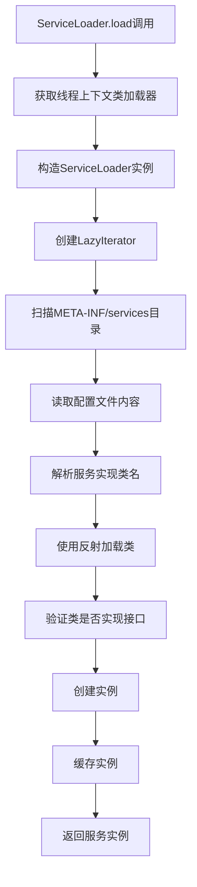

# SPI机制详解

## 1. 什么是SPI机制

### 1.1 SPI定义与背景
SPI（Service Provider Interface）即服务提供者接口，是Java平台提供的一套用于服务发现的机制。SPI的设计理念源于面向对象编程中的依赖倒置原则（Dependency Inversion Principle），它将接口的定义与实现完全分离，使得程序在运行时能够动态地发现并加载具体的服务实现。

SPI机制最早在JDK 1.3中引入，主要用于解决在不修改原有代码的情况下，为程序提供扩展能力的问题。它是Java平台可扩展性的重要基础，为许多重要的Java技术提供了底层支持。

### 1.2 SPI的核心思想
- **解耦合**：服务接口的定义与具体实现完全分离，降低了模块间的耦合度
- **可扩展性**：支持在运行时动态发现和加载新的服务实现，无需修改现有代码
- **标准化**：提供了统一的服务发现规范，确保了不同实现之间的一致性
- **插件化**：为应用程序提供了强大的插件机制支持

### 1.3 SPI与API的深度对比

| 维度 | API (Application Programming Interface) | SPI (Service Provider Interface) |
|------|----------------------------------------|-----------------------------------|
| **定义目的** | 为应用程序提供功能调用接口 | 为服务提供者定义实现规范 |
| **调用方向** | 应用程序调用接口实现 | 接口实现被框架调用 |
| **控制反转** | 调用者主动调用 | 被动被调用（IoC） |
| **扩展机制** | 通常需要修改代码添加新功能 | 无需修改代码即可扩展功能 |
| **配置方式** | 硬编码或配置文件指定 | 通过META-INF/services自动发现 |
| **典型应用** | 第三方库提供的功能接口 | 插件系统、驱动程序 |
| **生命周期** | 由调用者管理 | 由服务加载器管理 |

### 1.4 SPI的设计模式分析
SPI机制实际上是多种设计模式的综合应用：

- **策略模式**：不同的服务实现代表不同的策略
- **工厂模式**：ServiceLoader充当抽象工厂角色
- **观察者模式**：框架观察并响应新服务的加入
- **模板方法模式**：定义了服务发现的标准流程

## 2. SPI机制深层原理

### 2.1 类加载机制详解
SPI的核心依赖于Java的类加载机制。当ServiceLoader.load()被调用时，会触发以下过程：

1. **双亲委派模型**：遵循Java类加载的双亲委派模型
2. **线程上下文类加载器**：使用Thread.currentThread().getContextClassLoader()
3. **资源定位**：在classpath中搜索META-INF/services目录
4. **延迟加载**：实现类在第一次被访问时才真正加载

### 2.2 ServiceLoader源码深度解析

基于[JavaGuide的分析](https://github.com/Snailclimb/JavaGuide/blob/main/docs/java/basis/spi.md)，我们深入了解ServiceLoader的工作机制：

#### 2.2.1 核心字段和构造过程

```java
public final class ServiceLoader<S> implements Iterable<S> {
    // 服务接口的Class对象
    private final Class<S> service;
    
    // 类加载器
    private final ClassLoader loader;
    
    // 访问控制上下文
    private final AccessControlContext acc;
    
    // 缓存已实例化的服务提供者
    private LinkedHashMap<String,S> providers = new LinkedHashMap<>();
    
    // 懒加载迭代器
    private LazyIterator lookupIterator;
    
    // SPI配置文件路径前缀
    private static final String PREFIX = "META-INF/services/";
}
```

#### 2.2.2 服务加载方法分析

```java
// 主要的load方法，使用线程上下文类加载器
public static <S> ServiceLoader<S> load(Class<S> service) {
    ClassLoader cl = Thread.currentThread().getContextClassLoader();
    return ServiceLoader.load(service, cl);
}

// 重载方法，可以指定类加载器
public static <S> ServiceLoader<S> load(Class<S> service, ClassLoader loader) {
    return new ServiceLoader<>(service, loader);
}

// 私有构造方法
private ServiceLoader(Class<S> svc, ClassLoader cl) {
    service = Objects.requireNonNull(svc, "Service interface cannot be null");
    loader = (cl == null) ? ClassLoader.getSystemClassLoader() : cl;
    acc = (System.getSecurityManager() != null) ? AccessController.getContext() : null;
    reload();
}

// 重新加载服务
public void reload() {
    providers.clear();
    lookupIterator = new LazyIterator(service, loader);
}
```

#### 2.2.3 线程上下文类加载器的作用

**关键理解：** `ClassLoader cl = Thread.currentThread().getContextClassLoader();`

这行代码解决了Java双亲委派模型在SPI场景下的局限性：
- **双亲委派模型**：子类加载器可以访问父类加载器加载的类，但父类加载器无法访问子类加载器加载的类
- **SPI场景问题**：核心库（如JDBC）由启动类加载器加载，但具体实现（如MySQL驱动）由应用类加载器加载
- **解决方案**：线程上下文类加载器允许核心库加载应用程序类路径上的实现类

#### 2.2.4 迭代器实现机制

```java
public Iterator<S> iterator() {
    return new Iterator<S>() {
        Iterator<Map.Entry<String, S>> knownProviders
                = providers.entrySet().iterator();

        public boolean hasNext() {
            if (knownProviders.hasNext())
                return true;
            return lookupIterator.hasNext(); // 调用LazyIterator
        }

        public S next() {
            if (knownProviders.hasNext())
                return knownProviders.next().getValue();
            return lookupIterator.next(); // 调用LazyIterator
        }

        public void remove() {
            throw new UnsupportedOperationException();
        }
    };
}
```

#### 2.2.5 LazyIterator核心实现

```java
// 检查是否有下一个服务
private boolean hasNextService() {
    if (nextName != null) {
        return true;
    }
    if (configs == null) {
        try {
            // 通过PREFIX（META-INF/services/）和类名获取配置文件
            String fullName = PREFIX + service.getName();
            if (loader == null)
                configs = ClassLoader.getSystemResources(fullName);
            else
                configs = loader.getResources(fullName);
        } catch (IOException x) {
            fail(service, "Error locating configuration files", x);
        }
    }
    while ((pending == null) || !pending.hasNext()) {
        if (!configs.hasMoreElements()) {
            return false;
        }
        pending = parse(service, configs.nextElement());
    }
    nextName = pending.next();
    return true;
}

// 获取下一个服务实例
private S nextService() {
    if (!hasNextService())
        throw new NoSuchElementException();
    String cn = nextName;
    nextName = null;
    Class<?> c = null;
    try {
        c = Class.forName(cn, false, loader);
    } catch (ClassNotFoundException x) {
        fail(service, "Provider " + cn + " not found");
    }
    if (!service.isAssignableFrom(c)) {
        fail(service, "Provider " + cn + " not a subtype");
    }
    try {
        S p = service.cast(c.newInstance());
        providers.put(cn, p);
        return p;
    } catch (Throwable x) {
        fail(service, "Provider " + cn + " could not be instantiated", x);
    }
    throw new Error(); // This cannot happen
}
```

### 2.3 自定义ServiceLoader实现

为了更好地理解SPI机制，我们来实现一个简化版的ServiceLoader：

```java
package com.example.spi;

import java.io.BufferedReader;
import java.io.InputStream;
import java.io.InputStreamReader;
import java.lang.reflect.Constructor;
import java.net.URL;
import java.net.URLConnection;
import java.util.ArrayList;
import java.util.Enumeration;
import java.util.List;

/**
 * 自定义ServiceLoader实现
 * 参考JavaGuide的实现思路
 */
public class MyServiceLoader<S> {

    // 对应的接口Class模板
    private final Class<S> service;

    // 对应实现类的列表，可以有多个
    private final List<S> providers = new ArrayList<>();

    // 类加载器
    private final ClassLoader classLoader;

    // 暴露给外部使用的方法，通过调用这个方法可以开始加载自定制的实现流程
    public static <S> MyServiceLoader<S> load(Class<S> service) {
        return new MyServiceLoader<>(service);
    }

    // 构造方法私有化
    private MyServiceLoader(Class<S> service) {
        this.service = service;
        this.classLoader = Thread.currentThread().getContextClassLoader();
        doLoad();
    }

    // 关键方法，加载具体实现类的逻辑
    private void doLoad() {
        try {
            // 读取所有jar包里面META-INF/services包下面的文件
            // 这个文件名就是接口名，然后文件里面的内容就是具体的实现类的路径加全类名
            Enumeration<URL> urls = classLoader.getResources("META-INF/services/" + service.getName());
            
            // 挨个遍历取到的文件
            while (urls.hasMoreElements()) {
                // 取出当前的文件
                URL url = urls.nextElement();
                System.out.println("Loading SPI file: " + url.getPath());
                
                // 建立链接
                URLConnection urlConnection = url.openConnection();
                urlConnection.setUseCaches(false);
                
                // 获取文件输入流
                InputStream inputStream = urlConnection.getInputStream();
                
                // 从文件输入流获取缓存
                BufferedReader bufferedReader = new BufferedReader(new InputStreamReader(inputStream));
                
                // 从文件内容里面得到实现类的全类名
                String className = bufferedReader.readLine();

                while (className != null) {
                    // 过滤注释和空行
                    className = className.trim();
                    if (className.isEmpty() || className.startsWith("#")) {
                        className = bufferedReader.readLine();
                        continue;
                    }
                    
                    // 处理行内注释
                    int commentIndex = className.indexOf('#');
                    if (commentIndex != -1) {
                        className = className.substring(0, commentIndex).trim();
                    }
                    
                    try {
                        // 通过反射拿到实现类的实例
                        Class<?> clazz = Class.forName(className, false, classLoader);
                        
                        // 如果声明的接口跟这个具体的实现类是属于同一类型
                        // （可以理解为Java的一种多态，接口跟实现类、父类和子类等等这种关系）
                        // 则构造实例
                        if (service.isAssignableFrom(clazz)) {
                            Constructor<? extends S> constructor = 
                                (Constructor<? extends S>) clazz.getConstructor();
                            S instance = constructor.newInstance();
                            
                            // 把当前构造的实例对象添加到Provider的列表里面
                            providers.add(instance);
                            System.out.println("Successfully loaded: " + className);
                        } else {
                            System.err.println("Class " + className + 
                                " does not implement " + service.getName());
                        }
                    } catch (Exception e) {
                        System.err.println("Failed to load class: " + className + 
                            ", error: " + e.getMessage());
                    }
                    
                    // 继续读取下一行的实现类，可以有多个实现类，只需要换行就可以了
                    className = bufferedReader.readLine();
                }
                
                bufferedReader.close();
                inputStream.close();
            }
        } catch (Exception e) {
            System.err.println("Error reading SPI configuration files: " + e.getMessage());
        }
    }

    // 返回SPI接口对应的具体实现类列表
    public List<S> getProviders() {
        return new ArrayList<>(providers);
    }
    
    // 获取第一个实现类（如果存在）
    public S getFirstProvider() {
        return providers.isEmpty() ? null : providers.get(0);
    }
    
    // 根据类名获取特定实现
    public S getProvider(String className) {
        return providers.stream()
                .filter(provider -> provider.getClass().getName().equals(className))
                .findFirst()
                .orElse(null);
    }
    
    // 获取实现类数量
    public int size() {
        return providers.size();
    }
    
    // 检查是否有实现类
    public boolean isEmpty() {
        return providers.isEmpty();
    }
}
```

### 2.4 自定义ServiceLoader的使用示例

```java
// 使用自定义ServiceLoader
public class CustomSPIDemo {
    public static void main(String[] args) {
        // 加载PaymentService的所有实现
        MyServiceLoader<PaymentService> loader = MyServiceLoader.load(PaymentService.class);
        
        System.out.println("Found " + loader.size() + " implementations:");
        
        // 遍历所有实现
        for (PaymentService service : loader.getProviders()) {
            System.out.println("Provider: " + service.getClass().getName());
            System.out.println("Name: " + service.getProviderName());
            System.out.println("Methods: " + Arrays.toString(service.getSupportedMethods()));
            System.out.println("---");
        }
        
        // 获取第一个实现
        PaymentService firstService = loader.getFirstProvider();
        if (firstService != null) {
            PaymentRequest request = new PaymentRequest("ORDER123", 100.0, "CNY", "balance");
            PaymentResult result = firstService.pay(request);
            System.out.println("Payment result: " + result.isSuccess());
        }
        
        // 根据类名获取特定实现
        PaymentService alipay = loader.getProvider("com.example.spi.impl.AlipayServiceImpl");
        if (alipay != null) {
            System.out.println("Found Alipay implementation: " + alipay.getProviderName());
        }
    }
}
```

### 2.5 ServiceLoader工作原理总结

**核心流程：**
1. **资源定位**：通过ClassLoader查找META-INF/services目录下的配置文件
2. **文件解析**：读取配置文件内容，解析出实现类的全限定名
3. **类加载**：使用指定的ClassLoader加载实现类
4. **类型检查**：验证实现类是否实现了指定的服务接口
5. **实例创建**：通过反射机制创建实现类的实例
6. **缓存管理**：将创建的实例缓存起来，避免重复创建

**关键技术点：**
- **延迟加载**：LazyIterator确保只有在需要时才加载和实例化服务
- **线程上下文类加载器**：解决双亲委派模型的限制
- **异常处理**：提供详细的错误信息和失败恢复机制
- **缓存机制**：提高性能，避免重复加载相同的服务实现

**实现特点：**
- SPI机制的具体实现本质上还是通过反射完成的
- 按照规定将要暴露对外使用的具体实现类在`META-INF/services/`文件下声明
- 支持多个实现类的同时加载和使用
- 提供了良好的扩展性和可维护性

### 2.4 目录结构规范

SPI机制的实现需要严格遵循Java规范的目录结构。以下是完整的项目目录结构示例：

#### 2.3.1 服务接口项目结构
```
service-provider-interface/
├─ src/
│  └─ main/
│     └─ java/
│        └─ com/
│           └─ example/
│              └─ spi/
│                 ├─ Logger.java              # SPI服务接口
│                 └─ LoggerService.java       # 服务使用者类
├─ target/
│  └─ service-provider-interface.jar         # 打包后的接口jar
└─ pom.xml                                   # Maven配置文件
```

#### 2.3.2 服务实现项目结构
```
service-provider/
├─ lib/
│  └─ service-provider-interface.jar         # 依赖的接口jar包
├─ src/
│  ├─ main/
│  │  └─ java/
│  │     └─ com/
│  │        └─ example/
│  │           └─ spi/
│  │              └─ impl/
│  │                 ├─ LogbackImpl.java     # SPI实现类1
│  │                 ├─ Log4jImpl.java       # SPI实现类2
│  │                 └─ ConsoleImpl.java     # SPI实现类3
│  └─ main/
│     └─ resources/
│        └─ META-INF/
│           └─ services/
│              └─ com.example.spi.Logger     # SPI配置文件
├─ target/
│  └─ service-provider.jar                   # 打包后的实现jar
└─ pom.xml
```

#### 2.3.3 Maven项目完整结构
```
spi-demo/
├─ spi-interface/                            # 接口模块
│  ├─ src/
│  │  └─ main/
│  │     └─ java/
│  │        └─ com/
│  │           └─ example/
│  │              └─ spi/
│  │                 ├─ PaymentService.java
│  │                 ├─ PaymentRequest.java
│  │                 ├─ PaymentResult.java
│  │                 └─ PaymentManager.java
│  └─ pom.xml
│
├─ spi-alipay-impl/                          # 支付宝实现模块
│  ├─ src/
│  │  ├─ main/
│  │  │  ├─ java/
│  │  │  │  └─ com/
│  │  │  │     └─ example/
│  │  │  │        └─ spi/
│  │  │  │           └─ impl/
│  │  │  │              └─ AlipayServiceImpl.java
│  │  │  └─ resources/
│  │  │     └─ META-INF/
│  │  │        └─ services/
│  │  │           └─ com.example.spi.PaymentService
│  │  └─ test/
│  │     └─ java/
│  └─ pom.xml
│
├─ spi-wechat-impl/                          # 微信支付实现模块
│  ├─ src/
│  │  ├─ main/
│  │  │  ├─ java/
│  │  │  │  └─ com/
│  │  │  │     └─ example/
│  │  │  │        └─ spi/
│  │  │  │           └─ impl/
│  │  │  │              └─ WechatPayServiceImpl.java
│  │  │  └─ resources/
│  │  │     └─ META-INF/
│  │  │        └─ services/
│  │  │           └─ com.example.spi.PaymentService
│  │  └─ test/
│  │     └─ java/
│  └─ pom.xml
│
├─ spi-test/                                 # 测试模块
│  ├─ src/
│  │  └─ main/
│  │     └─ java/
│  │        └─ com/
│  │           └─ example/
│  │              └─ test/
│  │                 └─ SPITest.java
│  └─ pom.xml
│
└─ pom.xml                                   # 父级POM文件
```

#### 2.3.4 关键文件说明

**1. SPI配置文件规范**
- **文件路径**：必须位于 `src/main/resources/META-INF/services/` 目录下
- **文件名称**：必须是SPI接口的完全限定类名（如：`com.example.spi.PaymentService`）
- **文件内容**：实现类的完全限定类名，每行一个，支持注释（#开头）

```
# 支付宝实现
com.example.spi.impl.AlipayServiceImpl

# 微信支付实现  
com.example.spi.impl.WechatPayServiceImpl

# 银联支付实现
com.example.spi.impl.UnionPayServiceImpl
```

**2. 目录结构最佳实践**
- 接口定义与实现分离，便于版本管理
- 每个实现放在独立的模块中，支持按需引入
- 测试代码与生产代码分离
- 资源文件与源代码分离

### 2.5 SPI与API的深度对比

参考[JavaGuide的SPI机制详解](https://github.com/Snailclimb/JavaGuide/blob/main/docs/java/basis/spi.md)，我们来深入对比SPI和API的差异：


| 维度 | API (Application Programming Interface) | SPI (Service Provider Interface) |
|------|----------------------------------------|-----------------------------------|
| **定义目的** | 为应用程序提供功能调用接口 | 为服务提供者定义实现规范 |
| **调用方向** | 应用程序调用接口实现 | 接口实现被框架调用 |
| **控制反转** | 调用者主动调用 | 被动被调用（IoC） |
| **扩展机制** | 通常需要修改代码添加新功能 | 无需修改代码即可扩展功能 |
| **配置方式** | 硬编码或配置文件指定 | 通过META-INF/services自动发现 |
| **典型应用** | 第三方库提供的功能接口 | 插件系统、驱动程序 |
| **生命周期** | 由调用者管理 | 由服务加载器管理 |
| **接口位置** | 实现方提供接口和实现 | 调用方定义接口规范 |
| **耦合程度** | 相对较高 | 低耦合 |

**举例说明：**
- **API模式**：当你使用Apache HttpClient库时，库提供了HttpClient接口和DefaultHttpClient实现，你通过调用这些API来发送HTTP请求
- **SPI模式**：JDBC定义了Driver接口规范，MySQL、Oracle等数据库厂商按照这个规范提供各自的驱动实现，应用程序无需修改代码就能切换不同的数据库

### 2.6 服务发现的详细流程

基于ServiceLoader的源码分析，SPI的服务发现流程如下：



**关键步骤详解：**

1. **线程上下文类加载器获取**：`Thread.currentThread().getContextClassLoader()`
2. **资源定位**：在classpath中搜索 `META-INF/services/接口全限定名` 文件
3. **配置解析**：读取文件内容，解析出实现类的全限定名
4. **类加载验证**：使用`Class.forName()`加载类，并验证是否实现了指定接口
5. **实例化**：通过反射调用无参构造器创建实例
6. **缓存管理**：将创建的实例缓存到providers中，避免重复创建

### 2.7 配置文件解析机制详解

SPI配置文件的解析遵循严格的规范：

**文件格式规范：**
```
# 这是注释行，以#开头
com.example.impl.DefaultPaymentService

# 支持空行

# 多个实现类
com.example.impl.AlipayPaymentService
com.example.impl.WechatPaymentService

# 行末注释也被支持
com.example.impl.UnionPayService  # 银联支付实现
```

**解析规则：**
- **文件编码**：必须是UTF-8编码
- **注释支持**：以`#`开头的行和行内注释会被忽略
- **空行处理**：自动忽略空行和只含空白字符的行
- **类名格式**：必须是完全限定的类名（包名.类名）
- **顺序保证**：按文件中出现的顺序加载服务
- **错误处理**：类名不存在或格式错误会抛出ServiceConfigurationError

**配置文件示例：**
```
# META-INF/services/com.example.spi.PaymentService

# 主要支付实现
com.example.payment.impl.AlipayPaymentServiceImpl
com.example.payment.impl.WechatPayServiceImpl

# 备用支付实现  
com.example.payment.impl.BankCardPaymentServiceImpl

# 测试环境专用
# com.example.payment.impl.MockPaymentServiceImpl
```

## 3. SPI实现的完整实践

### 3.1 高级服务接口设计

```java
package com.example.service;

import java.util.Map;
import java.util.concurrent.CompletableFuture;

/**
 * 支付服务接口 - 展示SPI的高级用法
 */
public interface PaymentService {
    
    /**
     * 获取支付提供者名称
     */
    String getProviderName();
    
    /**
     * 获取支持的支付方式
     */
    String[] getSupportedMethods();
    
    /**
     * 同步支付
     */
    PaymentResult pay(PaymentRequest request);
    
    /**
     * 异步支付
     */
    CompletableFuture<PaymentResult> payAsync(PaymentRequest request);
    
    /**
     * 获取配置信息
     */
    Map<String, Object> getConfiguration();
    
    /**
     * 服务健康检查
     */
    boolean isHealthy();
    
    /**
     * 初始化服务
     */
    default void initialize(Map<String, Object> config) {
        // 默认实现为空
    }
    
    /**
     * 销毁服务
     */
    default void destroy() {
        // 默认实现为空
    }
}

// 支付请求实体
class PaymentRequest {
    private String orderId;
    private double amount;
    private String currency;
    private String method;
    private Map<String, Object> metadata;
    
    // 构造函数、getter、setter省略
}

// 支付结果实体
class PaymentResult {
    private boolean success;
    private String transactionId;
    private String message;
    private long timestamp;
    
    // 构造函数、getter、setter省略
}
```

### 3.2 复杂服务实现示例

```java
// 支付宝支付实现
package com.example.service.impl;

import java.util.concurrent.CompletableFuture;
import java.util.concurrent.Executors;
import java.util.concurrent.ThreadPoolExecutor;

public class AlipayService implements PaymentService {
    
    private ThreadPoolExecutor executor;
    private Map<String, Object> config;
    private volatile boolean initialized = false;
    
    @Override
    public void initialize(Map<String, Object> config) {
        this.config = config;
        this.executor = (ThreadPoolExecutor) Executors.newFixedThreadPool(
            (Integer) config.getOrDefault("threadPoolSize", 10)
        );
        this.initialized = true;
    }
    
    @Override
    public String getProviderName() {
        return "Alipay";
    }
    
    @Override
    public String[] getSupportedMethods() {
        return new String[]{"balance", "bankcard", "credit"};
    }
    
    @Override
    public PaymentResult pay(PaymentRequest request) {
        if (!initialized) {
            throw new IllegalStateException("Service not initialized");
        }
        
        try {
            // 模拟支付处理
            Thread.sleep(100);
            
            return new PaymentResult(
                true,
                "alipay_" + System.currentTimeMillis(),
                "Payment successful",
                System.currentTimeMillis()
            );
        } catch (InterruptedException e) {
            Thread.currentThread().interrupt();
            return new PaymentResult(false, null, "Payment interrupted", 0);
        }
    }
    
    @Override
    public CompletableFuture<PaymentResult> payAsync(PaymentRequest request) {
        return CompletableFuture.supplyAsync(() -> pay(request), executor);
    }
    
    @Override
    public Map<String, Object> getConfiguration() {
        return Map.of(
            "maxAmount", 50000.0,
            "supportedCurrencies", new String[]{"CNY", "USD"},
            "feeRate", 0.006
        );
    }
    
    @Override
    public boolean isHealthy() {
        return initialized && !executor.isShutdown();
    }
    
    @Override
    public void destroy() {
        if (executor != null) {
            executor.shutdown();
        }
    }
}

// 微信支付实现
package com.example.service.impl;

public class WechatPayService implements PaymentService {
    
    private Map<String, Object> config;
    private volatile boolean healthy = true;
    
    @Override
    public void initialize(Map<String, Object> config) {
        this.config = config;
        // 模拟初始化过程
        System.out.println("WechatPay initialized with config: " + config);
    }
    
    @Override
    public String getProviderName() {
        return "WechatPay";
    }
    
    @Override
    public String[] getSupportedMethods() {
        return new String[]{"balance", "bankcard", "jsapi", "native"};
    }
    
    @Override
    public PaymentResult pay(PaymentRequest request) {
        if (!healthy) {
            return new PaymentResult(false, null, "Service unhealthy", 0);
        }
        
        // 模拟支付逻辑
        return new PaymentResult(
            true,
            "wx_" + System.currentTimeMillis(),
            "WeChat payment successful",
            System.currentTimeMillis()
        );
    }
    
    @Override
    public CompletableFuture<PaymentResult> payAsync(PaymentRequest request) {
        return CompletableFuture.completedFuture(pay(request));
    }
    
    @Override
    public Map<String, Object> getConfiguration() {
        return Map.of(
            "maxAmount", 20000.0,
            "supportedCurrencies", new String[]{"CNY"},
            "feeRate", 0.008
        );
    }
    
    @Override
    public boolean isHealthy() {
        return healthy;
    }
}
```

### 3.3 高级服务管理器实现

```java
package com.example.manager;

import java.util.*;
import java.util.concurrent.ConcurrentHashMap;
import java.util.concurrent.CompletableFuture;
import java.util.concurrent.TimeUnit;
import java.util.stream.Collectors;

/**
 * 高级支付服务管理器
 * 提供服务发现、生命周期管理、健康检查等功能
 */
public class AdvancedPaymentManager {
    
    private static final Map<String, PaymentService> serviceCache = new ConcurrentHashMap<>();
    private static final Map<String, Long> lastHealthCheck = new ConcurrentHashMap<>();
    private static volatile boolean initialized = false;
    
    // 健康检查间隔（毫秒）
    private static final long HEALTH_CHECK_INTERVAL = 30000;
    
    static {
        initialize();
    }
    
    /**
     * 初始化服务管理器
     */
    private static void initialize() {
        if (initialized) return;
        
        synchronized (AdvancedPaymentManager.class) {
            if (initialized) return;
            
            ServiceLoader<PaymentService> loader = ServiceLoader.load(PaymentService.class);
            
            for (PaymentService service : loader) {
                try {
                    // 初始化服务
                    Map<String, Object> config = loadServiceConfig(service.getProviderName());
                    service.initialize(config);
                    
                    // 验证服务
                    if (service.isHealthy()) {
                        serviceCache.put(service.getProviderName(), service);
                        lastHealthCheck.put(service.getProviderName(), System.currentTimeMillis());
                        System.out.println("Successfully loaded payment service: " + service.getProviderName());
                    } else {
                        System.err.println("Service health check failed: " + service.getProviderName());
                    }
                } catch (Exception e) {
                    System.err.println("Failed to load payment service: " + service.getProviderName() + ", error: " + e.getMessage());
                }
            }
            
            // 启动健康检查定时任务
            startHealthCheckScheduler();
            
            initialized = true;
        }
    }
    
    /**
     * 获取所有可用的支付服务
     */
    public static List<PaymentService> getAvailableServices() {
        return serviceCache.values().stream()
                .filter(service -> isServiceHealthy(service.getProviderName()))
                .collect(Collectors.toList());
    }
    
    /**
     * 根据提供者名称获取支付服务
     */
    public static PaymentService getService(String providerName) {
        PaymentService service = serviceCache.get(providerName);
        if (service != null && isServiceHealthy(providerName)) {
            return service;
        }
        return null;
    }
    
    /**
     * 根据支付方式获取支持的服务
     */
    public static List<PaymentService> getServicesByMethod(String method) {
        return serviceCache.values().stream()
                .filter(service -> isServiceHealthy(service.getProviderName()))
                .filter(service -> Arrays.asList(service.getSupportedMethods()).contains(method))
                .collect(Collectors.toList());
    }
    
    /**
     * 执行支付并自动选择最佳服务
     */
    public static CompletableFuture<PaymentResult> payWithBestService(PaymentRequest request) {
        List<PaymentService> availableServices = getServicesByMethod(request.getMethod());
        
        if (availableServices.isEmpty()) {
            return CompletableFuture.completedFuture(
                new PaymentResult(false, null, "No available payment service", 0)
            );
        }
        
        // 选择最佳服务（这里简单选择第一个，实际可以基于负载、费率等因素）
        PaymentService bestService = selectBestService(availableServices, request);
        
        return bestService.payAsync(request)
                .exceptionally(throwable -> 
                    new PaymentResult(false, null, "Payment failed: " + throwable.getMessage(), 0)
                );
    }
    
    /**
     * 选择最佳支付服务
     */
    private static PaymentService selectBestService(List<PaymentService> services, PaymentRequest request) {
        // 可以基于多种因素选择：
        // 1. 费率最低
        // 2. 支持的最大金额
        // 3. 服务响应速度
        // 4. 历史成功率等
        
        return services.stream()
                .min((s1, s2) -> {
                    Double rate1 = (Double) s1.getConfiguration().get("feeRate");
                    Double rate2 = (Double) s2.getConfiguration().get("feeRate");
                    return Double.compare(rate1, rate2);
                })
                .orElse(services.get(0));
    }
    
    /**
     * 检查服务是否健康
     */
    private static boolean isServiceHealthy(String providerName) {
        Long lastCheck = lastHealthCheck.get(providerName);
        if (lastCheck == null) return false;
        
        long now = System.currentTimeMillis();
        if (now - lastCheck > HEALTH_CHECK_INTERVAL) {
            // 需要重新检查
            PaymentService service = serviceCache.get(providerName);
            if (service != null) {
                boolean healthy = service.isHealthy();
                lastHealthCheck.put(providerName, now);
                return healthy;
            }
            return false;
        }
        
        return true;
    }
    
    /**
     * 启动健康检查调度器
     */
    private static void startHealthCheckScheduler() {
        Timer timer = new Timer("PaymentServiceHealthChecker", true);
        timer.scheduleAtFixedRate(new TimerTask() {
            @Override
            public void run() {
                performHealthCheck();
            }
        }, HEALTH_CHECK_INTERVAL, HEALTH_CHECK_INTERVAL);
    }
    
    /**
     * 执行健康检查
     */
    private static void performHealthCheck() {
        serviceCache.forEach((name, service) -> {
            try {
                boolean healthy = service.isHealthy();
                if (!healthy) {
                    System.warn("Payment service " + name + " is unhealthy");
                }
            } catch (Exception e) {
                System.err.println("Health check failed for service " + name + ": " + e.getMessage());
            }
        });
    }
    
    /**
     * 加载服务配置
     */
    private static Map<String, Object> loadServiceConfig(String providerName) {
        // 从配置文件或环境变量加载配置
        Map<String, Object> config = new HashMap<>();
        
        switch (providerName.toLowerCase()) {
            case "alipay":
                config.put("threadPoolSize", 20);
                config.put("timeout", 5000);
                break;
            case "wechatpay":
                config.put("timeout", 3000);
                config.put("retryCount", 3);
                break;
        }
        
        return config;
    }
    
    /**
     * 关闭服务管理器
     */
    public static void shutdown() {
        serviceCache.values().forEach(service -> {
            try {
                service.destroy();
            } catch (Exception e) {
                System.err.println("Error destroying service: " + e.getMessage());
            }
        });
        serviceCache.clear();
        lastHealthCheck.clear();
    }
}
```

### 3.4 使用示例

```java
package com.example.demo;

public class PaymentDemo {
    public static void main(String[] args) {
        // 1. 获取所有可用服务
        List<PaymentService> services = AdvancedPaymentManager.getAvailableServices();
        System.out.println("Available services: " + 
            services.stream().map(PaymentService::getProviderName).collect(Collectors.toList()));
        
        // 2. 获取特定服务
        PaymentService alipay = AdvancedPaymentManager.getService("Alipay");
        if (alipay != null) {
            System.out.println("Alipay config: " + alipay.getConfiguration());
        }
        
        // 3. 根据支付方式获取服务
        List<PaymentService> balanceServices = AdvancedPaymentManager.getServicesByMethod("balance");
        System.out.println("Services supporting balance payment: " + 
            balanceServices.stream().map(PaymentService::getProviderName).collect(Collectors.toList()));
        
        // 4. 执行支付
        PaymentRequest request = new PaymentRequest("ORDER123", 100.0, "CNY", "balance");
        
        AdvancedPaymentManager.payWithBestService(request)
            .thenAccept(result -> {
                if (result.isSuccess()) {
                    System.out.println("Payment successful: " + result.getTransactionId());
                } else {
                    System.err.println("Payment failed: " + result.getMessage());
                }
            })
            .exceptionally(throwable -> {
                System.err.println("Payment error: " + throwable.getMessage());
                return null;
            });
        
        // 等待异步操作完成
        try {
            Thread.sleep(1000);
        } catch (InterruptedException e) {
            Thread.currentThread().interrupt();
        }
        
        // 5. 关闭服务管理器
        AdvancedPaymentManager.shutdown();
    }
}
```

## 4. SPI的深度应用场景

### 4.1 Java核心库中的SPI应用

#### 4.1.1 JDBC驱动机制详解
```java
// JDBC SPI的实现原理
public class DriverManager {
    // 注册的驱动列表
    private final static CopyOnWriteArrayList<DriverInfo> registeredDrivers 
        = new CopyOnWriteArrayList<>();
    
    static {
        loadInitialDrivers(); // 通过SPI加载驱动
        println("JDBC DriverManager initialized");
    }
    
    private static void loadInitialDrivers() {
        // 使用SPI机制加载驱动
        ServiceLoader<Driver> loadedDrivers = ServiceLoader.load(Driver.class);
        Iterator<Driver> driversIterator = loadedDrivers.iterator();
        
        try {
            while(driversIterator.hasNext()) {
                driversIterator.next();
            }
        } catch(Throwable t) {
            // 处理加载异常
        }
    }
}

// MySQL驱动的SPI配置文件：
// META-INF/services/java.sql.Driver
// com.mysql.cj.jdbc.Driver
```

#### 4.1.2 日志框架的SPI机制
```java
// SLF4J的StaticLoggerBinder查找机制
public final class LoggerFactory {
    
    static {
        performInitialization();
    }
    
    private final static void performInitialization() {
        bind(); // SPI绑定过程
        versionSanityCheck();
    }
    
    private final static void bind() {
        try {
            // 查找StaticLoggerBinder
            Set<URL> staticLoggerBinderPathSet = findPossibleStaticLoggerBinderPathSet();
            reportMultipleBindingAmbiguity(staticLoggerBinderPathSet);
            
            // 绑定具体实现
            StaticLoggerBinder.getSingleton();
            INITIALIZATION_STATE = SUCCESSFUL_INITIALIZATION;
        } catch (Exception e) {
            failedBinding(e);
        }
    }
}
```

### 4.2 企业级应用中的SPI实践

#### 4.2.1 消息中间件的协议扩展
```java
// 消息协议接口
public interface MessageProtocol {
    String getProtocolName();
    String getVersion();
    boolean supports(String contentType);
    
    MessageSerializer getSerializer();
    MessageDeserializer getDeserializer();
    
    void configure(Properties config);
}

// Kafka协议实现
public class KafkaProtocol implements MessageProtocol {
    @Override
    public String getProtocolName() {
        return "kafka";
    }
    
    @Override
    public boolean supports(String contentType) {
        return contentType.startsWith("application/kafka");
    }
    
    // 其他实现...
}

// RabbitMQ协议实现
public class RabbitMQProtocol implements MessageProtocol {
    @Override
    public String getProtocolName() {
        return "rabbitmq";
    }
    
    @Override
    public boolean supports(String contentType) {
        return contentType.startsWith("application/amqp");
    }
    
    // 其他实现...
}
```

#### 4.2.2 数据存储适配器模式
```java
// 数据存储接口
public interface DataStorageProvider {
    String getProviderType();
    String[] getSupportedOperations();
    
    void connect(StorageConfig config);
    void disconnect();
    
    void save(String key, Object data);
    <T> T load(String key, Class<T> type);
    void delete(String key);
    
    boolean exists(String key);
    List<String> listKeys(String pattern);
}

// Redis存储实现
public class RedisStorageProvider implements DataStorageProvider {
    private RedisTemplate<String, Object> redisTemplate;
    
    @Override
    public String getProviderType() {
        return "redis";
    }
    
    @Override
    public String[] getSupportedOperations() {
        return new String[]{"save", "load", "delete", "exists", "listKeys", "expire"};
    }
    
    @Override
    public void connect(StorageConfig config) {
        // Redis连接配置
        JedisConnectionFactory factory = new JedisConnectionFactory();
        factory.setHostName(config.getHost());
        factory.setPort(config.getPort());
        factory.setPassword(config.getPassword());
        factory.afterPropertiesSet();
        
        redisTemplate = new RedisTemplate<>();
        redisTemplate.setConnectionFactory(factory);
        redisTemplate.setDefaultSerializer(new GenericJackson2JsonRedisSerializer());
        redisTemplate.afterPropertiesSet();
    }
    
    @Override
    public void save(String key, Object data) {
        redisTemplate.opsForValue().set(key, data);
    }
    
    @Override
    public <T> T load(String key, Class<T> type) {
        Object value = redisTemplate.opsForValue().get(key);
        return type.cast(value);
    }
    
    // 其他实现...
}

// MongoDB存储实现
public class MongoStorageProvider implements DataStorageProvider {
    private MongoTemplate mongoTemplate;
    
    @Override
    public String getProviderType() {
        return "mongodb";
    }
    
    @Override
    public String[] getSupportedOperations() {
        return new String[]{"save", "load", "delete", "exists", "listKeys", "query"};
    }
    
    // 实现略...
}
```

## 5. SPI的高级特性与优化

### 5.1 多ClassLoader环境下的SPI

```java
/**
 * 多ClassLoader环境下的SPI管理器
 */
public class MultiClassLoaderSPIManager {
    
    private final Map<ClassLoader, ServiceLoader<?>> loaderCache = new ConcurrentHashMap<>();
    
    @SuppressWarnings("unchecked")
    public <T> List<T> loadServices(Class<T> serviceClass, ClassLoader... classLoaders) {
        List<T> allServices = new ArrayList<>();
        
        // 如果没有指定ClassLoader，使用默认的
        if (classLoaders.length == 0) {
            classLoaders = new ClassLoader[]{
                Thread.currentThread().getContextClassLoader(),
                serviceClass.getClassLoader(),
                ClassLoader.getSystemClassLoader()
            };
        }
        
        for (ClassLoader cl : classLoaders) {
            try {
                ServiceLoader<T> loader = (ServiceLoader<T>) loaderCache.computeIfAbsent(cl, 
                    k -> ServiceLoader.load(serviceClass, k));
                
                for (T service : loader) {
                    allServices.add(service);
                }
            } catch (Exception e) {
                System.err.println("Failed to load services with ClassLoader: " + cl + ", error: " + e.getMessage());
            }
        }
        
        return allServices;
    }
    
    /**
     * 重新加载服务（清除缓存）
     */
    public void reload() {
        loaderCache.clear();
    }
}
```

### 5.2 SPI服务的优先级和过滤机制

```java
/**
 * 支持优先级的SPI服务接口
 */
public interface PriorityService {
    /**
     * 获取服务优先级，数值越小优先级越高
     */
    default int getPriority() {
        return Integer.MAX_VALUE;
    }
    
    /**
     * 判断服务是否可用
     */
    default boolean isAvailable() {
        return true;
    }
}

/**
 * 支持优先级和过滤的服务管理器
 */
public class PriorityServiceManager {
    
    public static <T extends PriorityService> List<T> loadServicesWithPriority(Class<T> serviceClass) {
        ServiceLoader<T> loader = ServiceLoader.load(serviceClass);
        
        return StreamSupport.stream(loader.spliterator(), false)
                .filter(PriorityService::isAvailable)
                .sorted(Comparator.comparingInt(PriorityService::getPriority))
                .collect(Collectors.toList());
    }
    
    public static <T extends PriorityService> Optional<T> loadHighestPriorityService(Class<T> serviceClass) {
        return loadServicesWithPriority(serviceClass).stream().findFirst();
    }
    
    /**
     * 根据条件过滤服务
     */
    public static <T> List<T> loadServicesWithFilter(Class<T> serviceClass, Predicate<T> filter) {
        ServiceLoader<T> loader = ServiceLoader.load(serviceClass);
        
        return StreamSupport.stream(loader.spliterator(), false)
                .filter(filter)
                .collect(Collectors.toList());
    }
}
```

### 5.3 SPI服务的生命周期管理

```java
/**
 * 具有生命周期管理的服务接口
 */
public interface ManagedService {
    
    /**
     * 服务状态枚举
     */
    enum ServiceState {
        INITIALIZED, STARTING, RUNNING, STOPPING, STOPPED, ERROR
    }
    
    /**
     * 获取当前服务状态
     */
    ServiceState getState();
    
    /**
     * 启动服务
     */
    void start() throws ServiceException;
    
    /**
     * 停止服务
     */
    void stop() throws ServiceException;
    
    /**
     * 服务是否正在运行
     */
    default boolean isRunning() {
        return getState() == ServiceState.RUNNING;
    }
    
    /**
     * 添加状态变更监听器
     */
    void addStateChangeListener(ServiceStateChangeListener listener);
}

/**
 * 服务状态变更监听器
 */
@FunctionalInterface
public interface ServiceStateChangeListener {
    void onStateChanged(ManagedService service, ServiceState oldState, ServiceState newState);
}

/**
 * 生命周期服务管理器
 */
public class LifecycleServiceManager {
    
    private final Map<String, ManagedService> services = new ConcurrentHashMap<>();
    private final List<ServiceStateChangeListener> globalListeners = new CopyOnWriteArrayList<>();
    
    /**
     * 加载并启动所有服务
     */
    public <T extends ManagedService> void loadAndStartServices(Class<T> serviceClass) {
        ServiceLoader<T> loader = ServiceLoader.load(serviceClass);
        
        for (T service : loader) {
            try {
                // 添加全局监听器
                globalListeners.forEach(service::addStateChangeListener);
                
                // 启动服务
                service.start();
                
                services.put(service.getClass().getName(), service);
                System.out.println("Started service: " + service.getClass().getName());
                
            } catch (Exception e) {
                System.err.println("Failed to start service: " + service.getClass().getName() + ", error: " + e.getMessage());
            }
        }
    }
    
    /**
     * 停止所有服务
     */
    public void stopAllServices() {
        services.values().parallelStream().forEach(service -> {
            try {
                if (service.isRunning()) {
                    service.stop();
                }
            } catch (Exception e) {
                System.err.println("Failed to stop service: " + service.getClass().getName() + ", error: " + e.getMessage());
            }
        });
        
        services.clear();
    }
    
    /**
     * 获取服务状态报告
     */
    public Map<String, ServiceState> getServiceStates() {
        return services.entrySet().stream()
                .collect(Collectors.toMap(
                    Map.Entry::getKey,
                    entry -> entry.getValue().getState()
                ));
    }
    
    /**
     * 添加全局状态监听器
     */
    public void addGlobalStateChangeListener(ServiceStateChangeListener listener) {
        globalListeners.add(listener);
    }
}
```

## 6. SPI性能优化与监控

### 6.1 服务缓存和预加载机制

```java
/**
 * 高性能SPI服务缓存管理器
 */
public class CachedServiceManager {
    
    // 服务实例缓存
    private static final Map<Class<?>, List<Object>> serviceCache = new ConcurrentHashMap<>();
    
    // 服务元数据缓存
    private static final Map<Class<?>, ServiceMetadata> metadataCache = new ConcurrentHashMap<>();
    
    // 预加载标记
    private static final Set<Class<?>> preloadedServices = ConcurrentHashMap.newKeySet();
    
    /**
     * 预加载服务
     */
    public static <T> void preloadService(Class<T> serviceClass) {
        if (preloadedServices.contains(serviceClass)) {
            return;
        }
        
        synchronized (serviceClass) {
            if (preloadedServices.contains(serviceClass)) {
                return;
            }
            
            long startTime = System.currentTimeMillis();
            
            try {
                List<T> services = loadServicesInternal(serviceClass);
                serviceCache.put(serviceClass, new ArrayList<>(services));
                
                // 缓存元数据
                ServiceMetadata metadata = new ServiceMetadata(
                    serviceClass.getName(),
                    services.size(),
                    startTime,
                    System.currentTimeMillis()
                );
                metadataCache.put(serviceClass, metadata);
                
                preloadedServices.add(serviceClass);
                
                System.out.println("Preloaded " + services.size() + " services for " + 
                    serviceClass.getName() + " in " + (System.currentTimeMillis() - startTime) + "ms");
                
            } catch (Exception e) {
                System.err.println("Failed to preload services for " + serviceClass.getName() + ": " + e.getMessage());
            }
        }
    }
    
    /**
     * 获取缓存的服务
     */
    @SuppressWarnings("unchecked")
    public static <T> List<T> getCachedServices(Class<T> serviceClass) {
        List<Object> cached = serviceCache.get(serviceClass);
        if (cached != null) {
            return (List<T>) cached;
        }
        
        // 如果没有缓存，则加载并缓存
        preloadService(serviceClass);
        return getCachedServices(serviceClass);
    }
    
    /**
     * 内部服务加载方法
     */
    private static <T> List<T> loadServicesInternal(Class<T> serviceClass) {
        ServiceLoader<T> loader = ServiceLoader.load(serviceClass);
        List<T> services = new ArrayList<>();
        
        for (T service : loader) {
            services.add(service);
        }
        
        return services;
    }
    
    /**
     * 清除缓存
     */
    public static void clearCache() {
        serviceCache.clear();
        metadataCache.clear();
        preloadedServices.clear();
    }
    
    /**
     * 获取服务加载统计信息
     */
    public static Map<String, ServiceMetadata> getServiceStatistics() {
        return metadataCache.entrySet().stream()
                .collect(Collectors.toMap(
                    entry -> entry.getKey().getName(),
                    Map.Entry::getValue
                ));
    }
    
    /**
     * 服务元数据
     */
    public static class ServiceMetadata {
        private final String serviceName;
        private final int serviceCount;
        private final long loadStartTime;
        private final long loadEndTime;
        
        public ServiceMetadata(String serviceName, int serviceCount, long loadStartTime, long loadEndTime) {
            this.serviceName = serviceName;
            this.serviceCount = serviceCount;
            this.loadStartTime = loadStartTime;
            this.loadEndTime = loadEndTime;
        }
        
        public long getLoadDuration() {
            return loadEndTime - loadStartTime;
        }
        
        // getters...
    }
}
```

### 6.2 SPI服务监控和度量

```java
/**
 * SPI服务监控器
 */
public class SPIServiceMonitor {
    
    private final Map<String, ServiceMetrics> serviceMetrics = new ConcurrentHashMap<>();
    private final ScheduledExecutorService scheduler = Executors.newScheduledThreadPool(2);
    
    /**
     * 开始监控服务
     */
    public void startMonitoring() {
        // 定期收集度量数据
        scheduler.scheduleAtFixedRate(this::collectMetrics, 0, 30, TimeUnit.SECONDS);
        
        // 定期输出监控报告
        scheduler.scheduleAtFixedRate(this::generateReport, 60, 60, TimeUnit.SECONDS);
    }
    
    /**
     * 记录服务调用
     */
    public void recordServiceCall(String serviceName, long duration, boolean success) {
        serviceMetrics.computeIfAbsent(serviceName, k -> new ServiceMetrics(k))
                .recordCall(duration, success);
    }
    
    /**
     * 收集度量数据
     */
    private void collectMetrics() {
        serviceMetrics.values().forEach(ServiceMetrics::updateStatistics);
    }
    
    /**
     * 生成监控报告
     */
    private void generateReport() {
        System.out.println("\n=== SPI Service Monitoring Report ===");
        System.out.printf("%-20s %-10s %-10s %-15s %-15s %-10s%n", 
            "Service", "Calls", "Success", "Avg Duration", "Max Duration", "Success Rate");
        System.out.println("-".repeat(85));
        
        serviceMetrics.values().stream()
                .sorted((m1, m2) -> Long.compare(m2.getTotalCalls(), m1.getTotalCalls()))
                .forEach(metrics -> {
                    System.out.printf("%-20s %-10d %-10d %-15.2fms %-15dms %-10.1f%%%n",
                        metrics.getServiceName(),
                        metrics.getTotalCalls(),
                        metrics.getSuccessfulCalls(),
                        metrics.getAverageDuration(),
                        metrics.getMaxDuration(),
                        metrics.getSuccessRate() * 100
                    );
                });
        
        System.out.println("=".repeat(85) + "\n");
    }
    
    /**
     * 关闭监控器
     */
    public void shutdown() {
        scheduler.shutdown();
        try {
            if (!scheduler.awaitTermination(5, TimeUnit.SECONDS)) {
                scheduler.shutdownNow();
            }
        } catch (InterruptedException e) {
            scheduler.shutdownNow();
            Thread.currentThread().interrupt();
        }
    }
    
    /**
     * 服务度量数据
     */
    private static class ServiceMetrics {
        private final String serviceName;
        private final AtomicLong totalCalls = new AtomicLong();
        private final AtomicLong successfulCalls = new AtomicLong();
        private final AtomicLong totalDuration = new AtomicLong();
        private final AtomicLong maxDuration = new AtomicLong();
        private volatile double averageDuration = 0.0;
        private volatile double successRate = 0.0;
        
        public ServiceMetrics(String serviceName) {
            this.serviceName = serviceName;
        }
        
        public void recordCall(long duration, boolean success) {
            totalCalls.incrementAndGet();
            totalDuration.addAndGet(duration);
            maxDuration.updateAndGet(max -> Math.max(max, duration));
            
            if (success) {
                successfulCalls.incrementAndGet();
            }
        }
        
        public void updateStatistics() {
            long calls = totalCalls.get();
            if (calls > 0) {
                averageDuration = (double) totalDuration.get() / calls;
                successRate = (double) successfulCalls.get() / calls;
            }
        }
        
        // getters...
        public String getServiceName() { return serviceName; }
        public long getTotalCalls() { return totalCalls.get(); }
        public long getSuccessfulCalls() { return successfulCalls.get(); }
        public double getAverageDuration() { return averageDuration; }
        public long getMaxDuration() { return maxDuration.get(); }
        public double getSuccessRate() { return successRate; }
    }
}
```

## 7. SPI与现代框架的集成

### 7.1 Spring Boot中的SPI应用

```java
/**
 * Spring Boot自动配置中的SPI应用示例
 */
@Configuration
@ConditionalOnProperty(name = "app.spi.enabled", havingValue = "true", matchIfMissing = true)
public class SPIAutoConfiguration {
    
    @Bean
    @ConditionalOnMissingBean
    public SPIServiceRegistry spiServiceRegistry() {
        return new SPIServiceRegistry();
    }
    
    @Bean
    @ConditionalOnBean(SPIServiceRegistry.class)
    public SPIServiceInitializer spiServiceInitializer(SPIServiceRegistry registry) {
        return new SPIServiceInitializer(registry);
    }
    
    /**
     * SPI服务注册器
     */
    public static class SPIServiceRegistry implements BeanPostProcessor, ApplicationContextAware {
        
        private ApplicationContext applicationContext;
        private final Map<Class<?>, List<Object>> spiServices = new ConcurrentHashMap<>();
        
        @Override
        public void setApplicationContext(ApplicationContext applicationContext) throws BeansException {
            this.applicationContext = applicationContext;
        }
        
        @PostConstruct
        public void initializeSPIServices() {
            // 扫描并注册SPI服务
            discoverAndRegisterSPIServices();
        }
        
        private void discoverAndRegisterSPIServices() {
            // 获取所有标记了@SPIService的接口
            ClassPathScanningCandidateComponentProvider scanner = 
                new ClassPathScanningCandidateComponentProvider(false);
            scanner.addIncludeFilter(new AnnotationTypeFilter(SPIService.class));
            
            for (BeanDefinition bd : scanner.findCandidateComponents("com.example")) {
                try {
                    Class<?> serviceInterface = Class.forName(bd.getBeanClassName());
                    if (serviceInterface.isInterface()) {
                        loadSPIServices(serviceInterface);
                    }
                } catch (ClassNotFoundException e) {
                    // 处理异常
                }
            }
        }
        
        @SuppressWarnings("unchecked")
        private <T> void loadSPIServices(Class<T> serviceClass) {
            ServiceLoader<T> loader = ServiceLoader.load(serviceClass);
            List<T> services = new ArrayList<>();
            
            for (T service : loader) {
                services.add(service);
                
                // 如果服务需要Spring依赖注入
                if (service instanceof SpringAware) {
                    ((SpringAware) service).setApplicationContext(applicationContext);
                }
            }
            
            spiServices.put(serviceClass, (List<Object>) services);
        }
        
        public <T> List<T> getServices(Class<T> serviceClass) {
            return (List<T>) spiServices.getOrDefault(serviceClass, Collections.emptyList());
        }
    }
    
    /**
     * 标记SPI服务的注解
     */
    @Target(ElementType.TYPE)
    @Retention(RetentionPolicy.RUNTIME)
    @Documented
    public @interface SPIService {
        String value() default "";
    }
    
    /**
     * 需要Spring上下文的SPI服务接口
     */
    public interface SpringAware {
        void setApplicationContext(ApplicationContext applicationContext);
    }
}
```

### 7.2 Dubbo扩展点机制详解

```java
/**
 * 模拟Dubbo的扩展点机制
 */
public class ExtensionLoader<T> {
    
    private static final String SERVICES_DIRECTORY = "META-INF/services/";
    private static final String DUBBO_DIRECTORY = "META-INF/dubbo/";
    private static final String DUBBO_INTERNAL_DIRECTORY = "META-INF/dubbo/internal/";
    
    private final Class<?> type;
    private final ExtensionFactory objectFactory;
    
    private final Holder<Map<String, Class<?>>> cachedClasses = new Holder<>();
    private final ConcurrentMap<String, Holder<Object>> cachedInstances = new ConcurrentHashMap<>();
    private final Holder<Object> cachedAdaptiveInstance = new Holder<>();
    
    private ExtensionLoader(Class<?> type) {
        this.type = type;
        this.objectFactory = (type == ExtensionFactory.class ? null : 
            ExtensionLoader.getExtensionLoader(ExtensionFactory.class).getAdaptiveExtension());
    }
    
    public static <T> ExtensionLoader<T> getExtensionLoader(Class<T> type) {
        if (type == null) {
            throw new IllegalArgumentException("Extension type == null");
        }
        if (!type.isInterface()) {
            throw new IllegalArgumentException("Extension type (" + type + ") is not an interface!");
        }
        if (!withExtensionAnnotation(type)) {
            throw new IllegalArgumentException("Extension type (" + type + 
                ") is not an extension, because it is NOT annotated with @" + SPI.class.getSimpleName() + "!");
        }
        
        return EXTENSION_LOADERS.computeIfAbsent(type, k -> new ExtensionLoader<>(k));
    }
    
    /**
     * 获取扩展实例
     */
    public T getExtension(String name) {
        if (StringUtils.isEmpty(name)) {
            throw new IllegalArgumentException("Extension name == null");
        }
        if ("true".equals(name)) {
            return getDefaultExtension();
        }
        
        final Holder<Object> holder = getOrCreateHolder(name);
        Object instance = holder.get();
        if (instance == null) {
            synchronized (holder) {
                instance = holder.get();
                if (instance == null) {
                    instance = createExtension(name);
                    holder.set(instance);
                }
            }
        }
        return (T) instance;
    }
    
    /**
     * 创建扩展实例
     */
    private T createExtension(String name) {
        Class<?> clazz = getExtensionClasses().get(name);
        if (clazz == null) {
            throw new IllegalStateException("No such extension " + type.getName() + " by name " + name);
        }
        
        try {
            T instance = (T) EXTENSION_INSTANCES.get(clazz);
            if (instance == null) {
                EXTENSION_INSTANCES.putIfAbsent(clazz, clazz.newInstance());
                instance = (T) EXTENSION_INSTANCES.get(clazz);
            }
            
            injectExtension(instance);
            
            Set<Class<?>> wrapperClasses = cachedWrapperClasses;
            if (CollectionUtils.isNotEmpty(wrapperClasses)) {
                for (Class<?> wrapperClass : wrapperClasses) {
                    instance = injectExtension((T) wrapperClass.getConstructor(type).newInstance(instance));
                }
            }
            
            return instance;
        } catch (Throwable t) {
            throw new IllegalStateException("Extension instance (name: " + name + ", class: " +
                type + ") couldn't be instantiated: " + t.getMessage(), t);
        }
    }
    
    /**
     * 依赖注入
     */
    private T injectExtension(T instance) {
        if (objectFactory == null) {
            return instance;
        }
        
        try {
            for (Method method : instance.getClass().getMethods()) {
                if (!isSetter(method)) {
                    continue;
                }
                
                if (method.getAnnotation(DisableInject.class) != null) {
                    continue;
                }
                
                Class<?> pt = method.getParameterTypes()[0];
                if (ReflectUtils.isPrimitives(pt)) {
                    continue;
                }
                
                try {
                    String property = getSetterProperty(method);
                    Object object = objectFactory.getExtension(pt, property);
                    if (object != null) {
                        method.invoke(instance, object);
                    }
                } catch (Exception e) {
                    logger.error("Failed to inject via method " + method.getName()
                        + " of interface " + type.getName() + ": " + e.getMessage(), e);
                }
            }
        } catch (Exception e) {
            logger.error(e.getMessage(), e);
        }
        return instance;
    }
    
    /**
     * 加载扩展类
     */
    private Map<String, Class<?>> getExtensionClasses() {
        Map<String, Class<?>> classes = cachedClasses.get();
        if (classes == null) {
            synchronized (cachedClasses) {
                classes = cachedClasses.get();
                if (classes == null) {
                    classes = loadExtensionClasses();
                    cachedClasses.set(classes);
                }
            }
        }
        return classes;
    }
    
    /**
     * 从配置文件加载扩展类
     */
    private Map<String, Class<?>> loadExtensionClasses() {
        cacheDefaultExtensionName();
        
        Map<String, Class<?>> extensionClasses = new HashMap<>();
        
        for (LoadingStrategy strategy : strategies) {
            loadDirectory(extensionClasses, strategy.directory(), type.getName(), strategy.preferExtensionClassLoader(), strategy.excludedPackages());
        }
        
        return extensionClasses;
    }
}
```

## 8. SPI的最佳实践与陷阱

### 8.1 设计最佳实践

#### 8.1.1 接口设计原则
```java
/**
 * 良好的SPI接口设计示例
 */
public interface PluginService {
    
    /**
     * 插件元数据接口
     */
    interface PluginMetadata {
        String getName();
        String getVersion();
        String getDescription();
        String[] getDependencies();
        Map<String, Object> getProperties();
    }
    
    /**
     * 获取插件元数据
     */
    PluginMetadata getMetadata();
    
    /**
     * 插件初始化
     * @param context 初始化上下文
     * @throws PluginException 初始化失败时抛出
     */
    void initialize(PluginContext context) throws PluginException;
    
    /**
     * 插件执行
     * @param input 输入参数
     * @return 执行结果
     * @throws PluginException 执行失败时抛出
     */
    PluginResult execute(PluginInput input) throws PluginException;
    
    /**
     * 插件销毁
     */
    default void destroy() {
        // 默认空实现
    }
    
    /**
     * 检查插件是否支持指定操作
     */
    default boolean supports(String operation) {
        return true;
    }
    
    /**
     * 获取插件配置模式
     */
    default ConfigurationSchema getConfigurationSchema() {
        return ConfigurationSchema.empty();
    }
}
```

#### 8.1.2 异常处理策略
```java
/**
 * SPI异常处理最佳实践
 */
public class RobustServiceLoader<T> {
    
    private final Class<T> serviceClass;
    private final ServiceErrorHandler errorHandler;
    private final ServiceValidator<T> validator;
    
    public RobustServiceLoader(Class<T> serviceClass) {
        this.serviceClass = serviceClass;
        this.errorHandler = new DefaultServiceErrorHandler();
        this.validator = new DefaultServiceValidator<>();
    }
    
    /**
     * 安全地加载服务
     */
    public List<T> loadServices() {
        List<T> validServices = new ArrayList<>();
        ServiceLoader<T> loader = ServiceLoader.load(serviceClass);
        
        for (T service : loader) {
            try {
                // 验证服务
                ValidationResult result = validator.validate(service);
                if (result.isValid()) {
                    validServices.add(service);
                } else {
                    errorHandler.handleValidationError(service, result);
                }
            } catch (ServiceConfigurationError e) {
                errorHandler.handleConfigurationError(service, e);
            } catch (Exception e) {
                errorHandler.handleGenericError(service, e);
            }
        }
        
        return validServices;
    }
    
    /**
     * 服务错误处理器
     */
    public interface ServiceErrorHandler {
        void handleValidationError(Object service, ValidationResult result);
        void handleConfigurationError(Object service, ServiceConfigurationError error);
        void handleGenericError(Object service, Exception error);
    }
    
    /**
     * 默认错误处理器
     */
    public static class DefaultServiceErrorHandler implements ServiceErrorHandler {
        private static final Logger logger = LoggerFactory.getLogger(DefaultServiceErrorHandler.class);
        
        @Override
        public void handleValidationError(Object service, ValidationResult result) {
            logger.warn("Service validation failed: {} - {}", service.getClass().getName(), result.getErrorMessage());
        }
        
        @Override
        public void handleConfigurationError(Object service, ServiceConfigurationError error) {
            logger.error("Service configuration error: {} - {}", service.getClass().getName(), error.getMessage());
        }
        
        @Override
        public void handleGenericError(Object service, Exception error) {
            logger.error("Service loading error: {} - {}", service.getClass().getName(), error.getMessage(), error);
        }
    }
}
```

### 8.2 常见陷阱与解决方案

#### 8.2.1 ClassLoader泄漏问题
```java
/**
 * 防止ClassLoader泄漏的SPI管理器
 */
public class LeakPreventionSPIManager {
    
    private static final Map<ClassLoader, WeakReference<ServiceLoader<?>>> loaderCache = 
        new ConcurrentHashMap<>();
    
    /**
     * 使用WeakReference防止ClassLoader泄漏
     */
    public static <T> ServiceLoader<T> getServiceLoader(Class<T> serviceClass, ClassLoader classLoader) {
        WeakReference<ServiceLoader<?>> ref = loaderCache.get(classLoader);
        ServiceLoader<T> loader = null;
        
        if (ref != null) {
            loader = (ServiceLoader<T>) ref.get();
        }
        
        if (loader == null) {
            loader = ServiceLoader.load(serviceClass, classLoader);
            loaderCache.put(classLoader, new WeakReference<>(loader));
        }
        
        return loader;
    }
    
    /**
     * 清理失效的ClassLoader引用
     */
    public static void cleanupExpiredReferences() {
        loaderCache.entrySet().removeIf(entry -> entry.getValue().get() == null);
    }
    
    /**
     * 强制清理指定ClassLoader的缓存
     */
    public static void clearClassLoaderCache(ClassLoader classLoader) {
        loaderCache.remove(classLoader);
    }
}
```

#### 8.2.2 循环依赖检测
```java
/**
 * 循环依赖检测器
 */
public class CircularDependencyDetector {
    
    private final Map<Class<?>, Set<Class<?>>> dependencyGraph = new HashMap<>();
    private final ThreadLocal<Set<Class<?>>> currentPath = ThreadLocal.withInitial(HashSet::new);
    
    /**
     * 注册服务依赖关系
     */
    public void registerDependency(Class<?> service, Class<?> dependency) {
        dependencyGraph.computeIfAbsent(service, k -> new HashSet<>()).add(dependency);
    }
    
    /**
     * 检测循环依赖
     */
    public boolean hasCircularDependency(Class<?> service) {
        Set<Class<?>> path = currentPath.get();
        
        if (path.contains(service)) {
            // 发现循环依赖
            return true;
        }
        
        path.add(service);
        
        try {
            Set<Class<?>> dependencies = dependencyGraph.get(service);
            if (dependencies != null) {
                for (Class<?> dependency : dependencies) {
                    if (hasCircularDependency(dependency)) {
                        return true;
                    }
                }
            }
            return false;
        } finally {
            path.remove(service);
        }
    }
    
    /**
     * 获取依赖路径
     */
    public List<Class<?>> getDependencyPath(Class<?> service) {
        List<Class<?>> path = new ArrayList<>();
        buildDependencyPath(service, path, new HashSet<>());
        return path;
    }
    
    private void buildDependencyPath(Class<?> service, List<Class<?>> path, Set<Class<?>> visited) {
        if (visited.contains(service)) {
            return;
        }
        
        visited.add(service);
        path.add(service);
        
        Set<Class<?>> dependencies = dependencyGraph.get(service);
        if (dependencies != null) {
            for (Class<?> dependency : dependencies) {
                buildDependencyPath(dependency, path, visited);
            }
        }
    }
}
```

### 8.3 测试策略

#### 8.3.1 SPI服务单元测试
```java
/**
 * SPI服务测试工具类
 */
public class SPITestUtils {
    
    /**
     * 创建测试用的ServiceLoader
     */
    public static <T> ServiceLoader<T> createTestServiceLoader(Class<T> serviceClass, List<T> mockServices) {
        return new TestServiceLoader<>(serviceClass, mockServices);
    }
    
    /**
     * 测试专用的ServiceLoader实现
     */
    private static class TestServiceLoader<T> extends ServiceLoader<T> {
        private final List<T> services;
        
        public TestServiceLoader(Class<T> serviceClass, List<T> services) {
            this.services = new ArrayList<>(services);
        }
        
        @Override
        public Iterator<T> iterator() {
            return services.iterator();
        }
        
        @Override
        public void reload() {
            // 测试环境不需要重新加载
        }
    }
    
    /**
     * 验证SPI配置文件
     */
    public static void validateSPIConfiguration(Class<?> serviceClass) {
        String resourceName = "META-INF/services/" + serviceClass.getName();
        InputStream is = serviceClass.getClassLoader().getResourceAsStream(resourceName);
        
        if (is == null) {
            throw new AssertionError("SPI configuration file not found: " + resourceName);
        }
        
        try (BufferedReader reader = new BufferedReader(new InputStreamReader(is, StandardCharsets.UTF_8))) {
            String line;
            int lineNumber = 0;
            while ((line = reader.readLine()) != null) {
                lineNumber++;
                line = line.trim();
                
                if (line.isEmpty() || line.startsWith("#")) {
                    continue;
                }
                
                try {
                    Class<?> implClass = Class.forName(line);
                    if (!serviceClass.isAssignableFrom(implClass)) {
                        throw new AssertionError("Implementation class " + line + 
                            " does not implement " + serviceClass.getName());
                    }
                } catch (ClassNotFoundException e) {
                    throw new AssertionError("Implementation class not found at line " + 
                        lineNumber + ": " + line);
                }
            }
        } catch (IOException e) {
            throw new AssertionError("Error reading SPI configuration file: " + e.getMessage());
        }
    }
}

/**
 * SPI服务集成测试示例
 */
@TestMethodOrder(OrderAnnotation.class)
public class PaymentServiceSPITest {
    
    private AdvancedPaymentManager paymentManager;
    
    @BeforeEach
    void setUp() {
        paymentManager = new AdvancedPaymentManager();
    }
    
    @Test
    @Order(1)
    @DisplayName("验证SPI配置文件")
    void testSPIConfiguration() {
        SPITestUtils.validateSPIConfiguration(PaymentService.class);
    }
    
    @Test
    @Order(2)
    @DisplayName("测试服务发现")
    void testServiceDiscovery() {
        List<PaymentService> services = paymentManager.getAvailableServices();
        
        assertThat(services).isNotEmpty();
        assertThat(services).hasSize(2); // 期望有2个实现
        
        Set<String> providerNames = services.stream()
            .map(PaymentService::getProviderName)
            .collect(Collectors.toSet());
        
        assertThat(providerNames).containsExactlyInAnyOrder("Alipay", "WechatPay");
    }
    
    @Test
    @Order(3)
    @DisplayName("测试服务功能")
    void testServiceFunctionality() {
        PaymentService alipay = paymentManager.getService("Alipay");
        assertThat(alipay).isNotNull();
        
        PaymentRequest request = new PaymentRequest("TEST001", 100.0, "CNY", "balance");
        PaymentResult result = alipay.pay(request);
        
        assertThat(result.isSuccess()).isTrue();
        assertThat(result.getTransactionId()).isNotNull();
    }
    
    @Test
    @Order(4)
    @DisplayName("测试异步支付")
    void testAsyncPayment() throws Exception {
        PaymentRequest request = new PaymentRequest("TEST002", 200.0, "CNY", "balance");
        
        CompletableFuture<PaymentResult> future = paymentManager.payWithBestService(request);
        PaymentResult result = future.get(5, TimeUnit.SECONDS);
        
        assertThat(result.isSuccess()).isTrue();
        assertThat(result.getTransactionId()).isNotNull();
    }
    
    @AfterEach
    void tearDown() {
        if (paymentManager != null) {
            paymentManager.shutdown();
        }
    }
}
```

## 9. SPI在微服务架构中的应用

### 9.1 服务发现与注册
```java
/**
 * 微服务环境下的SPI服务发现
 */
public interface MicroserviceDiscovery {
    
    /**
     * 注册服务实例
     */
    void registerService(ServiceInstance instance);
    
    /**
     * 注销服务实例
     */
    void deregisterService(ServiceInstance instance);
    
    /**
     * 发现服务实例
     */
    List<ServiceInstance> discoverServices(String serviceName);
    
    /**
     * 监听服务变化
     */
    void watchServices(String serviceName, ServiceChangeListener listener);
}

// Consul实现
public class ConsulMicroserviceDiscovery implements MicroserviceDiscovery {
    private final ConsulClient consulClient;
    
    public ConsulMicroserviceDiscovery(ConsulClient consulClient) {
        this.consulClient = consulClient;
    }
    
    @Override
    public void registerService(ServiceInstance instance) {
        NewService service = new NewService();
        service.setId(instance.getId());
        service.setName(instance.getServiceName());
        service.setAddress(instance.getHost());
        service.setPort(instance.getPort());
        
        consulClient.agentServiceRegister(service);
    }
    
    @Override
    public List<ServiceInstance> discoverServices(String serviceName) {
        Response<List<HealthService>> response = consulClient.getHealthServices(serviceName, true, null);
        
        return response.getValue().stream()
                .map(healthService -> {
                    Service service = healthService.getService();
                    return new ServiceInstance(
                        service.getId(),
                        serviceName,
                        service.getAddress(),
                        service.getPort()
                    );
                })
                .collect(Collectors.toList());
    }
    
    // 其他方法实现...
}

// Eureka实现
public class EurekaMicroserviceDiscovery implements MicroserviceDiscovery {
    private final EurekaClient eurekaClient;
    
    // 实现略...
}
```

### 9.2 配置管理SPI
```java
/**
 * 分布式配置管理SPI
 */
public interface ConfigurationProvider {
    
    /**
     * 获取配置值
     */
    String getProperty(String key);
    
    /**
     * 获取配置值，带默认值
     */
    String getProperty(String key, String defaultValue);
    
    /**
     * 获取所有配置
     */
    Map<String, String> getAllProperties();
    
    /**
     * 监听配置变化
     */
    void addChangeListener(String key, ConfigChangeListener listener);
    
    /**
     * 配置是否存在
     */
    boolean containsKey(String key);
}

// Apollo配置中心实现
public class ApolloConfigurationProvider implements ConfigurationProvider {
    private final Config config;
    
    public ApolloConfigurationProvider() {
        this.config = ConfigService.getAppConfig();
    }
    
    @Override
    public String getProperty(String key) {
        return config.getProperty(key, null);
    }
    
    @Override
    public String getProperty(String key, String defaultValue) {
        return config.getProperty(key, defaultValue);
    }
    
    @Override
    public void addChangeListener(String key, ConfigChangeListener listener) {
        config.addChangeListener(changeEvent -> {
            if (changeEvent.changedKeys().contains(key)) {
                ConfigPropertyChangeEvent propertyChange = changeEvent.getChange(key);
                listener.onChange(key, propertyChange.getOldValue(), propertyChange.getNewValue());
            }
        });
    }
    
    // 其他方法实现...
}
```

## 10. 总结与展望

### 10.1 SPI机制的核心价值

SPI（Service Provider Interface）机制作为Java平台的核心扩展机制，其价值主要体现在以下几个方面：

1. **解耦合**：通过接口与实现的分离，实现了模块间的低耦合
2. **可扩展性**：支持运行时动态发现和加载新的服务实现
3. **标准化**：提供了统一的服务发现规范和实现模式
4. **插件化**：为应用程序提供了强大的插件机制支持

### 10.2 应用场景总结

| 应用领域 | 具体场景 | 核心优势 |
|----------|----------|----------|
| **基础设施** | JDBC驱动、日志框架 | 标准化接口，多厂商实现 |
| **企业应用** | 支付网关、消息中间件 | 动态扩展，热插拔支持 |
| **微服务架构** | 服务发现、配置管理 | 分布式环境下的灵活配置 |
| **开发框架** | Spring Boot、Dubbo | 自动配置，扩展点机制 |

### 10.5 最佳实践总结

1. **谨慎设计接口**：接口一旦发布就很难修改，需要充分考虑未来的扩展需求

2. **完善错误处理**：建立健壮的错误处理机制，避免单点故障

3. **合理使用缓存**：在性能和资源使用之间找到平衡点

4. **持续监控**：建立完善的监控体系，及时发现和解决问题

5. **版本管理**：建立清晰的版本管理策略，确保平滑升级

6. **文档维护**：保持文档的及时更新，降低使用门槛

SPI机制作为Java生态系统的重要组成部分，为构建可扩展、可维护的应用系统提供了强有力的支持。随着技术的不断发展，SPI机制也在持续演进，为开发者提供更好的开发体验和更强的扩展能力。

通过深入理解和合理应用SPI机制，我们可以构建出更加灵活、可扩展的软件系统，为企业的数字化转型提供坚实的技术基础。

### 10.3 SPI机制的优缺点分析

参考[JavaGuide的总结](https://github.com/Snailclimb/JavaGuide/blob/main/docs/java/basis/spi.md)，SPI机制在提供强大扩展能力的同时，也存在一些局限性：

#### 10.3.1 SPI机制的优势

1. **解耦和扩展性**
   - 服务接口与具体实现完全分离
   - 支持运行时动态发现和加载服务实现
   - 无需修改现有代码即可添加新的实现

2. **标准化和规范化**
   - 提供统一的服务发现规范
   - 遵循Java平台标准，兼容性好
   - 被广泛应用于各种开源框架

3. **插件化架构支持**
   - 为应用程序提供强大的插件机制
   - 支持第三方扩展和定制
   - 便于构建可扩展的系统架构

4. **透明的服务切换**
   - 可以在不修改调用代码的情况下切换实现
   - 支持多个实现并存
   - 便于A/B测试和灰度发布

#### 10.3.2 SPI机制的局限性

1. **性能开销**
   ```java
   // SPI需要遍历加载所有实现类，效率相对较低
   ServiceLoader<PaymentService> loader = ServiceLoader.load(PaymentService.class);
   for (PaymentService service : loader) {
       // 即使只需要一个实现，也会加载所有实现
       if ("Alipay".equals(service.getProviderName())) {
           return service;
       }
   }
   ```

2. **并发问题**
   ```java
   // 当多个ServiceLoader同时load时，可能存在并发问题
   // ServiceLoader本身不是线程安全的
   public class ConcurrentSPIIssue {
       public static void main(String[] args) {
           // 多线程同时加载可能导致问题
           for (int i = 0; i < 10; i++) {
               new Thread(() -> {
                   ServiceLoader<PaymentService> loader = ServiceLoader.load(PaymentService.class);
                   // 可能导致重复加载或加载异常
               }).start();
           }
       }
   }
   ```

3. **错误处理复杂**
   - 配置错误（如类名拼写错误）在运行时才能发现
   - 缺乏编译时检查
   - 调试困难，错误信息可能不够明确

4. **依赖管理挑战**
   - 实现类的依赖关系难以管理
   - 版本兼容性问题
   - 类路径配置复杂

#### 10.3.3 性能优化策略

为了解决SPI机制的性能问题，可以采用以下策略：

```java
/**
 * 单例模式缓存ServiceLoader
 */
public class OptimizedSPIManager {
    private static final Map<Class<?>, ServiceLoader<?>> LOADER_CACHE = new ConcurrentHashMap<>();
    private static final Map<Class<?>, List<?>> PROVIDER_CACHE = new ConcurrentHashMap<>();
    
    @SuppressWarnings("unchecked")
    public static <T> List<T> getProviders(Class<T> serviceClass) {
        return (List<T>) PROVIDER_CACHE.computeIfAbsent(serviceClass, key -> {
            ServiceLoader<T> loader = (ServiceLoader<T>) LOADER_CACHE.computeIfAbsent(
                serviceClass, ServiceLoader::load);
            
            List<T> providers = new ArrayList<>();
            for (T provider : loader) {
                providers.add(provider);
            }
            return providers;
        });
    }
    
    // 支持按需加载特定实现
    public static <T> T getProvider(Class<T> serviceClass, String providerName) {
        return getProviders(serviceClass).stream()
            .filter(provider -> provider.getClass().getSimpleName().contains(providerName))
            .findFirst()
            .orElse(null);
    }
}
```

#### 10.3.4 并发安全解决方案

```java
/**
 * 线程安全的SPI管理器
 */
public class ThreadSafeSPIManager {
    private static final ReentrantReadWriteLock lock = new ReentrantReadWriteLock();
    private static final Map<Class<?>, List<?>> cache = new HashMap<>();
    
    @SuppressWarnings("unchecked")
    public static <T> List<T> getProviders(Class<T> serviceClass) {
        // 读锁
        lock.readLock().lock();
        try {
            List<T> cached = (List<T>) cache.get(serviceClass);
            if (cached != null) {
                return new ArrayList<>(cached);
            }
        } finally {
            lock.readLock().unlock();
        }
        
        // 写锁
        lock.writeLock().lock();
        try {
            // 双重检查
            List<T> cached = (List<T>) cache.get(serviceClass);
            if (cached != null) {
                return new ArrayList<>(cached);
            }
            
            // 加载服务
            ServiceLoader<T> loader = ServiceLoader.load(serviceClass);
            List<T> providers = new ArrayList<>();
            for (T provider : loader) {
                providers.add(provider);
            }
            
            cache.put(serviceClass, providers);
            return new ArrayList<>(providers);
        } finally {
            lock.writeLock().unlock();
        }
    }
}
```

#### 10.3.5 SPI与其他机制的比较总结

| 特性 | SPI | Spring IoC | Dubbo SPI | OSGi |
|------|-----|------------|-----------|------|
| **学习成本** | 低 | 中 | 中 | 高 |
| **配置复杂度** | 低 | 中 | 中 | 高 |
| **性能** | 中 | 高 | 高 | 中 |
| **功能丰富度** | 基础 | 丰富 | 丰富 | 非常丰富 |
| **依赖注入** | 无 | 支持 | 支持 | 支持 |
| **热插拔** | 有限 | 有限 | 支持 | 完全支持 |
| **适用场景** | 简单扩展 | 企业应用 | 微服务 | 大型模块化系统 |

### 10.4 设计和使用建议

#### 10.4.1 设计阶段建议
- **接口稳定性**：确保接口设计的向后兼容性，一旦发布就很难修改
- **异常处理**：设计完善的异常处理和降级机制，提供友好的错误信息
- **文档完善**：提供清晰的使用文档和示例代码，降低使用门槛
- **测试覆盖**：建立完整的单元测试和集成测试，确保质量

#### 10.4.2 实现阶段建议
- **性能考虑**：合理使用缓存机制，避免重复加载相同的服务
- **资源管理**：注意ClassLoader泄漏和资源释放问题
- **并发安全**：考虑多线程环境下的安全性，使用合适的同步机制
- **监控告警**：建立完善的监控和告警机制，及时发现问题

#### 10.4.3 运维阶段建议
- **版本管理**：谨慎处理服务实现的版本升级，确保兼容性
- **故障隔离**：避免单个服务故障影响整体系统稳定性
- **性能监控**：持续监控服务加载和执行性能指标
- **容量规划**：根据服务使用情况进行合理的容量规划

### 10.5 技术发展趋势

#### 10.5.1 云原生环境适配
随着云原生技术的发展，SPI机制也在向容器化、微服务化方向演进：

- **容器化部署**：支持在容器环境中的动态服务发现和配置
- **服务网格集成**：与Istio、Linkerd等服务网格技术的深度集成
- **云原生配置**：支持Kubernetes ConfigMap、Secret等云原生配置方式
- **自动扩缩容**：根据服务负载自动调整实现类的实例数量

#### 10.5.2 模块化系统支持
Java 9引入的模块系统为SPI带来了新的特性和挑战：

```java
// module-info.java示例
module payment.api {
    exports com.example.payment.spi;
    uses com.example.payment.spi.PaymentService;
}

module payment.alipay {
    requires payment.api;
    provides com.example.payment.spi.PaymentService 
        with com.example.payment.alipay.AlipayServiceImpl;
}
```

- **模块边界**：在模块系统中明确服务的可见性和访问控制
- **强封装**：更好的封装性和安全性，减少意外的依赖
- **依赖管理**：更精确的模块依赖管理和版本控制

#### 10.5.3 性能优化方向
- **编译时优化**：通过编译时处理和代码生成减少运行时开销
- **AOT编译支持**：在GraalVM等AOT编译环境中的优化和适配
- **启动速度优化**：减少应用启动时的服务发现和加载时间
- **内存使用优化**：更高效的内存使用和垃圾回收策略

#### 10.5.4 智能化发展
- **自适应服务选择**：基于运行时指标自动选择最优的服务实现
- **机器学习集成**：使用ML算法优化服务路由和负载均衡
- **智能故障转移**：自动检测和切换到健康的服务实现

### 10.6 最佳实践总结

基于我们对SPI机制的深入分析和JavaGuide的经验总结，以下是关键的最佳实践：

#### 10.6.1 核心原则

1. **谨慎设计接口**
   ```java
   // 好的设计：考虑扩展性
   public interface PaymentService {
       PaymentResult pay(PaymentRequest request);
       
       // 提供默认实现，保持向后兼容
       default boolean supports(PaymentMethod method) {
           return true;
       }
       
       // 版本信息，便于兼容性管理
       default String getVersion() {
           return "1.0";
       }
   }
   ```

2. **完善错误处理**
   ```java
   // 建立健壮的错误处理机制
   public class RobustPaymentManager {
       public PaymentResult pay(PaymentRequest request) {
           try {
               PaymentService service = selectBestService(request);
               return service.pay(request);
           } catch (Exception e) {
               // 降级处理
               return handlePaymentFailure(request, e);
           }
       }
       
       private PaymentResult handlePaymentFailure(PaymentRequest request, Exception e) {
           // 记录错误日志
           logger.error("Payment failed for order: " + request.getOrderId(), e);
           
           // 尝试备用服务
           PaymentService fallbackService = getFallbackService();
           if (fallbackService != null) {
               return fallbackService.pay(request);
           }
           
           // 返回失败结果
           return PaymentResult.failure("Payment service unavailable");
       }
   }
   ```

3. **合理使用缓存**
   ```java
   // 在性能和资源使用之间找到平衡点
   public class CachedSPIManager {
       private final Cache<Class<?>, List<?>> cache = 
           Caffeine.newBuilder()
               .maximumSize(100)
               .expireAfterWrite(1, TimeUnit.HOURS)
               .build();
       
       @SuppressWarnings("unchecked")
       public <T> List<T> getServices(Class<T> serviceClass) {
           return (List<T>) cache.get(serviceClass, this::loadServices);
       }
   }
   ```

4. **持续监控**
   ```java
   // 建立完善的监控体系
   @Component
   public class SPIMonitoringService {
       private final MeterRegistry meterRegistry;
       
       public <T> T executeWithMonitoring(String serviceName, Supplier<T> action) {
           Timer.Sample sample = Timer.start(meterRegistry);
           try {
               T result = action.get();
               meterRegistry.counter("spi.service.success", "service", serviceName).increment();
               return result;
           } catch (Exception e) {
               meterRegistry.counter("spi.service.error", "service", serviceName).increment();
               throw e;
           } finally {
               sample.stop(Timer.builder("spi.service.duration")
                   .tag("service", serviceName)
                   .register(meterRegistry));
           }
       }
   }
   ```

#### 10.6.2 实施步骤

1. **评估需求**：确定是否真的需要SPI机制，避免过度设计
2. **设计接口**：定义清晰、稳定的服务接口
3. **实现服务**：按照接口规范实现具体的服务
4. **配置文件**：正确配置META-INF/services文件
5. **测试验证**：进行充分的功能和性能测试
6. **部署监控**：部署到生产环境并建立监控
7. **持续优化**：根据运行情况持续优化和改进

#### 10.6.3 避免常见陷阱

- **避免过度使用**：不是所有场景都适合SPI，简单的功能直接实现即可
- **注意性能影响**：在高并发场景下要特别注意SPI的性能开销
- **版本兼容性**：升级时要充分考虑向后兼容性
- **文档维护**：保持文档的及时更新，特别是接口变更时

SPI机制作为Java生态系统的重要组成部分，为构建可扩展、可维护的应用系统提供了强有力的支持。通过参考JavaGuide等权威资料，结合实际项目经验，我们可以更好地理解和应用这一重要技术，为软件架构的灵活性和可扩展性奠定坚实基础。